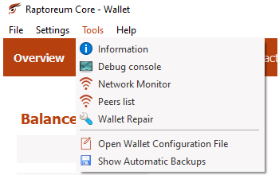
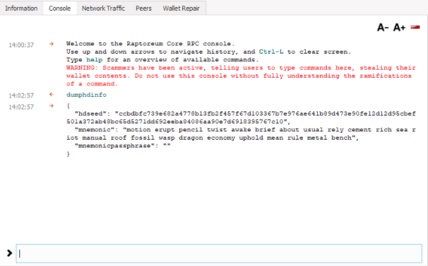
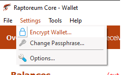

# HD Wallet

Enabling Hierarchical Deterministic (HD) Raptoreum Wallet

## Unix

Enter the following command from the command line. This will start a raptoreum wallet with a randomly generated HD wallet seed and no mnemonic passphrase:

```bash
raptoreum-qt.exe --usehd=1
```

After the wallet starts it will warn you that you need to encrypt your wallet after verifying that it works. Open the wallet debug console from Tools -> Debug Console and type the command to see your randomly generated 24-word mnemonic seed phrase as well as your seed in hexadecimal:

```bash
dumphdinfo
```

To restore an HD wallet you will need this 24-word seed phrase. You can restore a lost wallet, or create a new wallet with a custom separately generated 24-word mnemonic and passphrase, by running the following command from your command line. Make sure no existing wallet.dat file exists in the wallets data directory:

```bash
raptoreum-qt.exe --usehd=1 --mnemonic="YOUR 24-WORD SEED PHRASE" --mnemonicpassphrase="OPTIONAL PASSPHRASE"
```

The HD wallet will be restored and your private keys regenerated and your balance will appear after the blockchain sync has finished.


## Windows

Download the latest Raptoreum wallet from https://raptoreum.com/latest. I recommend getting the windows zip file and not the setup.exe as the steps shown below will use that file


Unzip this file and place it somewhere easy to navigate to. DO NOT run the wallet executable yet. You will need to navigate to it from the windows command line.

Open your windows command prompt by typing `cmd` in your windows search bar in your start bar


Navigate in the command prompt to wherever you extracted the zip file and run the exe with the `--usehd=1` parameter.

```bash
raptoreum-qt.exe --usehd=1
```


This will launch and start a new Raptoreum Core Wallet. Select where the wallet will save its data and hit ok

The wallet will give you a warning about encrypting your wallet. Select ok to continue. We will encrypt your wallet in a few minutes.


Once the wallet fully loads you can click hide to hide the status window about downloading the blockchain information. We can do these other steps while the wallet downloads and syncs the blockchain.

Open the Debug console so we can have the wallet display the 24-word mnemonic seed phrase you will need to store securely. This is your wallets recovery seed, anyone with this seed can regenerate your wallet and recover (or steal!) your coins. To open the console click Tools -> Debug console.




On the debug console we need to enter the dumphdinfo command. This will display the randomly generated 24-word mnemonic seed phrase as well as your seed in hexadecimal format.

:::note

The following image contains an actual seed phrase that I generated strictly for purposes of this guide. It contains no coins. Never share your seed phrase with anyone and store it securely!

:::



Write down the "mnemonic" that is displayed. This is the 24-words you need to recover your wallet in case of loss. Remember order and spelling matter and you need to capture this exactly as displayed. Store it somewhere securely. Engrave it on metal (seriously these products exist). At a minimum store it in a secure and well regarded password manager.

:::caution Word of Caution

It is a very bad idea to just paste your wallet seed phrase into a text document on your desktop.

:::

Next we will encrypt your wallet. This helps keep it secure while it is running on your computer. Click `Settings -> Encrypt Wallet`... and enter a password for your wallet. If you lose this password you will lose access to your coins. You will need to enter it to run some console commands such as `dumphdinfo` as well as any time you send coins.



You are now done generating your HD wallet.

## Restoring a lost HD wallet

You can restore your wallet with this seed phrase from the command line similar to the way you generated the HD wallet. You can restore a lost wallet by running the following command from your command line. Make sure no existing wallet.dat file exists in the wallets data directory:

```bash
raptoreum-qt.exe --usehd=1 --mnemonic="YOUR 24-WORD SEED PHRASE" --mnemonicpassphrase="OPTIONAL PASSPHRASE"
```

:::note

The mnemonicpassphrase is NOT your wallet encryption passphrase, this is an optional "25th-word" you can use when creating a wallet with a custom passphrase if you wish.

:::

The HD wallet will be restored and your private keys regenerated and your balance will appear after the blockchain sync has finished.